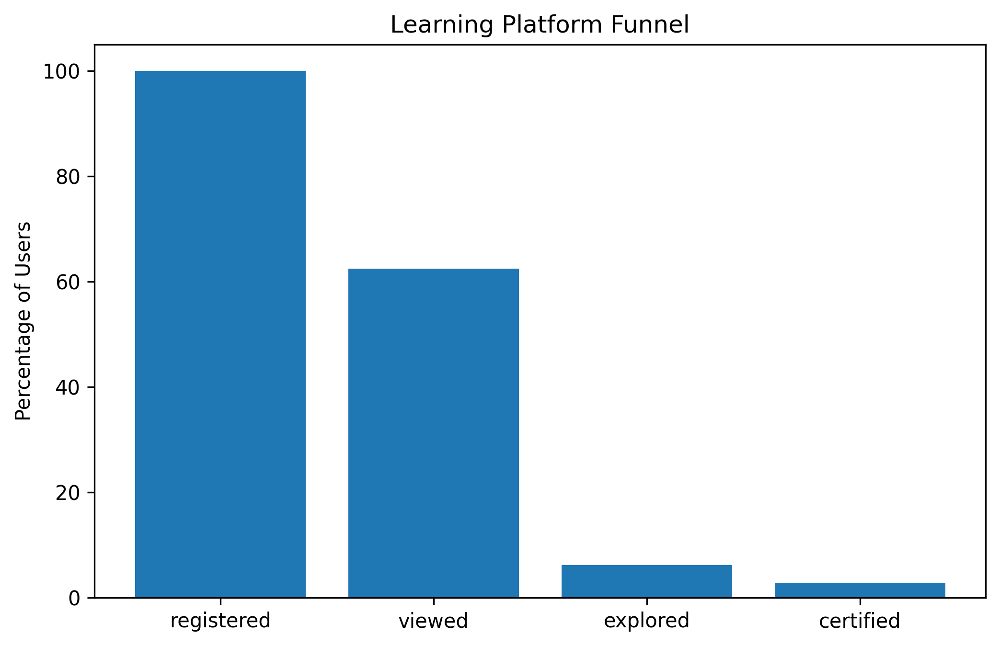
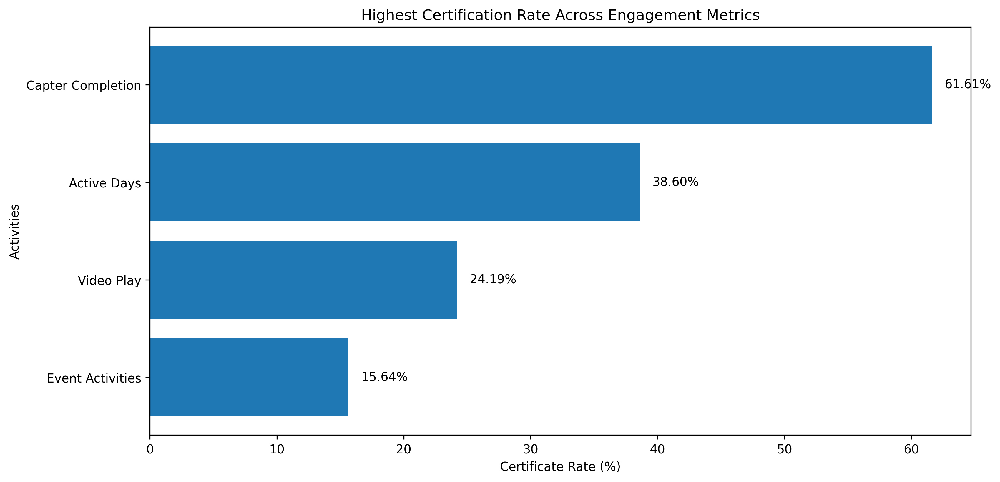
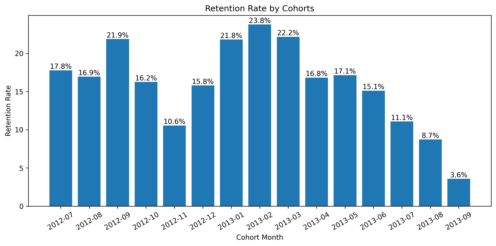
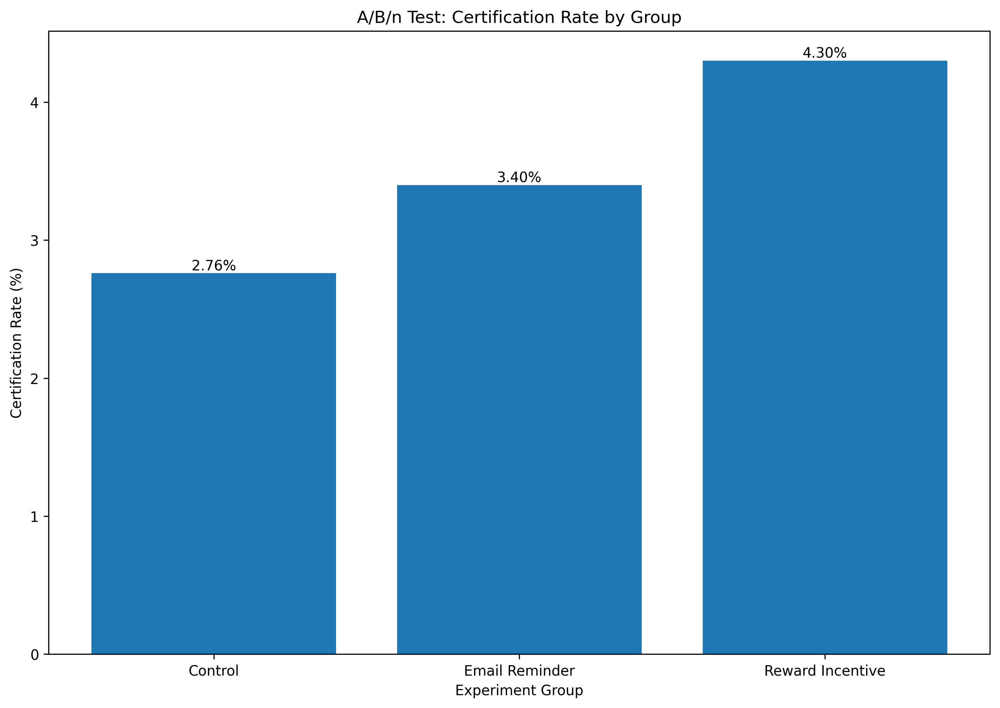
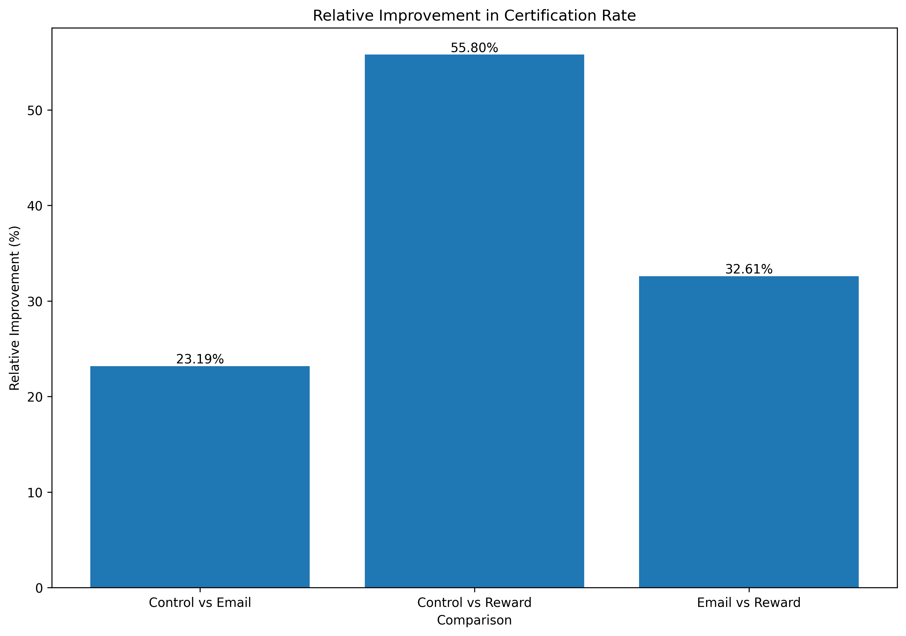
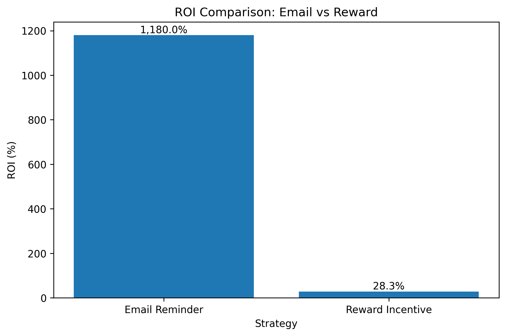
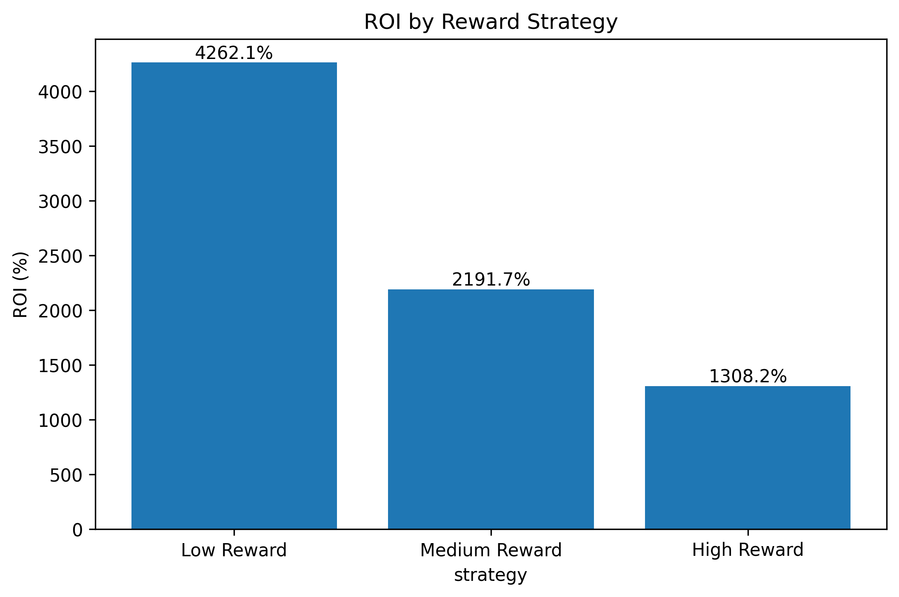
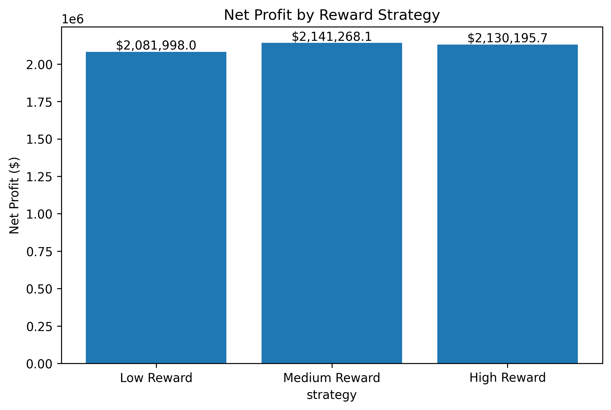

# Online Learning Engagement Analysis

## Project Overview

This project analyzes learner engagement behavior using HarvardX-MITx online learning platform data to identify key drivers of certification success, learner retention, and long-term engagement.

The objective is to understand how learner behavior influences certification outcomes and generate actionable product insights to improve learner retention, engagement, and completion rates.

Using exploratory data analysis, funnel analysis, cohort analysis, segmentation, and A/B/n testing simulation, this project evaluates how product interventions such as email reminders and reward incentives can improve certification performance.

This project is designed from a Product Analytics perspective, focusing on learner behavior, retention optimization, and data-driven product strategy.

## Key Findings

### 1. Chapter completion is the strongest predictor of certification success

Among all engagement metrics, chapter completion showed the strongest positive relationship with certification outcomes. Learners completing more chapters consistently achieved significantly higher certification rates.

---

### 2. Sustained engagement drives learner success

Longer active learning duration, higher platform activity, and greater video engagement strongly improved certification outcomes. Retention emerged as a major driver of course completion.

---

### 3. Cohort behavior reveals strong retention patterns

Enrollment showed clear cohort effects and seasonal learning patterns. Cohorts with higher retention consistently achieved better certification outcomes.

---

### 4. Incentive-based interventions outperform passive reminders

A/B/n testing showed both intervention strategies improved certification outcomes:

* Control: **2.76%**
* Email Reminder: **3.40%**
* Reward Incentive: **4.30%**

Reward incentives delivered the strongest certification improvement.

---

### 5. Medium reward strategy maximizes long-term business value

ROI analysis and long-term simulation revealed a critical business trade-off:

* Low Reward achieved the highest ROI
* Medium Reward generated the highest net profit
* High Reward showed diminishing returns due to rising reward costs

The optimal strategy is not the highest reward level, but the one that balances engagement improvement and profitability.

---

## Dataset

This project uses the HarvardX-MITx Person-Course dataset, a large-scale public MOOC dataset containing learner enrollment, engagement, and certification records across multiple online courses from 2012 to 2013.

### Dataset Features

* 641,138 learner-course records
* Multiple engagement metrics across learning activities
* Certification outcomes
* Learner demographic information
* Course-level behavioral data

### Key Variables

* `registered`: Registration status
* `viewed`: Whether learner viewed course materials
* `explored`: Whether learner actively explored the course
* `certified`: Certification outcome (target variable)
* `nevents`: Total platform activity events
* `ndays_act`: Number of active learning days
* `nplay_video`: Number of video plays
* `nchapters`: Number of chapters completed
* `nforum_posts`: Number of forum posts

---

## Key Skills Demonstrated

* Product Analytics
* Funnel Analysis
* Cohort Analysis
* Retention Analysis
* A/B/n Testing
* Statistical Hypothesis Testing
* ROI Analysis
* Business Intelligence
* Incentive Strategy Optimization
* Data-Driven Product Recommendations


## Project Objectives

The main objective of this project is to identify the key behavioral drivers that influence learner retention and certification success in online education platforms.

This analysis aims to answer the following business questions:

* What factors most strongly influence certification outcomes?
* Which engagement behaviors are most predictive of learner success?
* How do retention and certification vary across learner cohorts?
* Which product interventions can improve certification rates most effectively?

The ultimate goal is to generate actionable product recommendations that improve learner engagement, retention, and course completion.

---

## Key Analyses

This project includes the following analytical modules:

### 1. Exploratory Data Analysis (EDA)

* Data structure inspection
* Missing value analysis
* Distribution analysis of key engagement metrics
* Outlier detection and log transformation

### 2. Funnel Analysis

Learner conversion funnel from registration to certification:

* Registered
* Viewed
* Explored
* Certified

This analysis identifies major drop-off points in the learner journey.


### 3. Engagement Metrics Analysis

Core engagement metrics analyzed:

* Platform activity events (`nevents`)
* Active learning days (`ndays_act`)
* Video plays (`nplay_video`)
* Chapters completed (`nchapters`)

This analysis evaluates how different engagement behaviors relate to learner success.


### 4. Segmentation Analysis

Learners were segmented into engagement groups using quartile analysis to compare certification rates across different engagement levels.

### 5. Cohort Analysis

Cohort analysis was conducted based on learner registration month to examine:

* Enrollment trends
* Retention trends
* Certification trends

This analysis helps identify seasonal patterns and cohort-level performance differences.


### 6.  A/B/n Testing: Intervention Strategy Comparison

To evaluate learner engagement interventions, I designed a simulated A/B/n experiment comparing three strategies:

* **Control Group**: No intervention
* **Email Reminder Group**: Reminder emails sent to inactive learners
* **Reward Incentive Group**: Milestone-based rewards using redeemable learning points

### Certification Rates

* Control: **2.76%**
* Email Reminder: **3.40%**
* Reward Incentive: **4.30%**

#### Statistical Testing Results

All pairwise comparisons showed statistically significant improvements:

* Control vs Email: **p = 0.0088**
* Control vs Reward: **p < 0.0001**
* Email vs Reward: **p = 0.0009**

#### Key Findings

* Both interventions improved certification rates significantly
* Reward incentives produced the strongest lift
* Incentive-based interventions outperformed passive reminder strategies




---

### 7. ROI Analysis & Reward Strategy Optimization

Beyond evaluating intervention effectiveness, I analyzed the business impact of engagement strategies using ROI analysis and long-term profit simulation.
 
#### Short-Term ROI Analysis

Two intervention strategies were compared:

* **Email Reminder**
* **Reward Incentive**

Key findings:

* Email reminders delivered the highest short-term ROI due to minimal intervention cost.
* Reward incentives significantly improved certification rates but incurred higher operational costs.

This highlights an important business trade-off between engagement improvement and cost efficiency.

---

#### Long-Term Reward Strategy Simulation

To identify the most effective incentive strategy, I simulated reward optimization for high-engagement learners.

#### Reward Eligibility Criteria

Reward incentives were only offered to highly engaged learners:

* Learners completing **15+ chapters**

This targeted approach improves cost efficiency by focusing on learners with the highest probability of completion and retention.

#### Funnel-Based Targeting

Based on funnel analysis:

* Paying users: **39,686**
* Reward-eligible high-engagement users: **16,283**

---

### Reward Strategies Tested

Three reward strategies were simulated:

* **Low Reward**
* **Medium Reward**
* **High Reward**

Simulation considered three revenue components:

* Initial Course Revenue
* Certification Revenue
* Future Enrollment Revenue

---

#### Key Findings

* **Low Reward** achieved the highest ROI due to low intervention cost.
* **Medium Reward** generated the highest net profit.
* **High Reward** improved engagement further but showed diminishing returns due to rapidly increasing reward costs.

---

#### Strategic Recommendation

The optimal strategy is not the highest reward level, but the reward level that balances learner engagement and business profitability.

Simulation results suggest that a **Medium Reward Strategy** provides the strongest long-term business value by balancing:

* Certification improvement
* Learner retention
* Cost efficiency
* Profit maximization





---

## SQL Analysis

- SQL analysis was conducted to further investigate learner conversion patterns, course performance, and engagement behaviors at both course and user levels.

### 1. Funnel Analysis
- Registered Users: 641,138
- Viewed Users: 400,262
- Explored Users: 39,686
- Certified Users: 17,687

### Key Findings
- Large drop-off occurs between viewed and explored stages.
- Exploration is the major bottleneck in the learner funnel.

---

### 2. Course Performance Analysis

Top enrollment courses:
- HarvardX/CS50x/2012
- MITx/6.00x/2012_Fall

Top certification rate courses:
- MITx/14.73x/2013_Spring
- MITx/3.091x/2012_Fall

### Key Findings
- Enrollment does not strongly correlate with certification success.
- Popular courses attract traffic but not necessarily completion.

---

### 3. Certified vs Non-Certified Learner Behavior

Certified learners show dramatically higher engagement across all metrics.

Key findings:
- Active Days: 46.91 vs 4.13
- Events: 5159 vs 159
- Video Plays: 499 vs 19.66
- Chapters: 16.71 vs 1.75

### Conclusion

- SQL analysis consistently shows that engagement—not enrollment volume—is the strongest driver of certification success.

- Learners with higher active days, stronger platform interaction, greater video engagement, and higher chapter completion demonstrate significantly higher certification outcomes.

### Business Implication

- SQL analysis further confirms that learner success is primarily driven by engagement rather than enrollment volume alone.

- These findings suggest that improving early learner activation, sustained engagement, and targeted interventions for at-risk users should be the primary focus for platform optimization.


---

## Final Business Recommendations

Based on funnel analysis, engagement analysis, cohort analysis, A/B/n testing, and ROI simulation, the following product recommendations are proposed to improve learner success and maximize business value.

---

### 1. Prioritize chapter completion as the core engagement metric

Chapter completion emerged as the strongest predictor of certification success.

Product teams should monitor chapter completion as a primary KPI and identify early signals of learner drop-off.

Recommended actions:

* Track chapter completion rate by learner segment
* Detect early disengagement signals
* Trigger targeted interventions before learner churn

---

### 2. Improve retention during early learning stages

Funnel analysis revealed substantial drop-off before learners reach deeper engagement stages.

Improving retention during early-stage learning can significantly increase downstream certification rates.

Recommended actions:

* Optimize onboarding experience
* Introduce milestone reminders
* Reduce friction during early course progression

---

### 3. Use email reminders as a low-cost broad intervention

Email reminders delivered strong short-term ROI due to minimal intervention cost.

This makes email campaigns an efficient intervention for broad learner engagement.

Best use cases:

* Re-engaging inactive learners
* Encouraging course continuation
* Improving short-term retention

---

### 4. Apply reward incentives selectively to high-engagement learners

Reward incentives delivered the strongest improvement in certification performance.

However, broad incentive distribution can significantly increase costs.

Simulation results suggest reward programs should be targeted toward high-engagement learners, especially those reaching critical milestone thresholds (e.g. 15+ completed chapters).

This targeted approach improves:

* Cost efficiency
* Certification outcomes
* Long-term retention

---

### 5. Adopt a medium-reward strategy for long-term profit maximization

Long-term reward optimization simulation showed:

* Low Reward → Highest ROI
* Medium Reward → Highest Net Profit
* High Reward → Diminishing Returns

The Medium Reward strategy achieved the best balance between:

* Learner engagement
* Certification improvement
* Retention uplift
* Profitability

This makes it the most effective long-term incentive strategy.

---

### Strategic Conclusion

The most effective product strategy is a hybrid intervention model:

* Use low-cost email reminders for broad learner engagement
* Apply targeted medium-level reward incentives to high-potential learners

This hybrid strategy optimizes both learner success and long-term business performance by balancing growth, retention, and profitability.


---


## Tech Stack

* Python
* Pandas
* NumPy
* Matplotlib
* Statsmodels
* SQL (planned)
* Jupyter Notebook

## Repository Structure

```bash
data/
figures/
notebooks/
sql/
README.md
```
